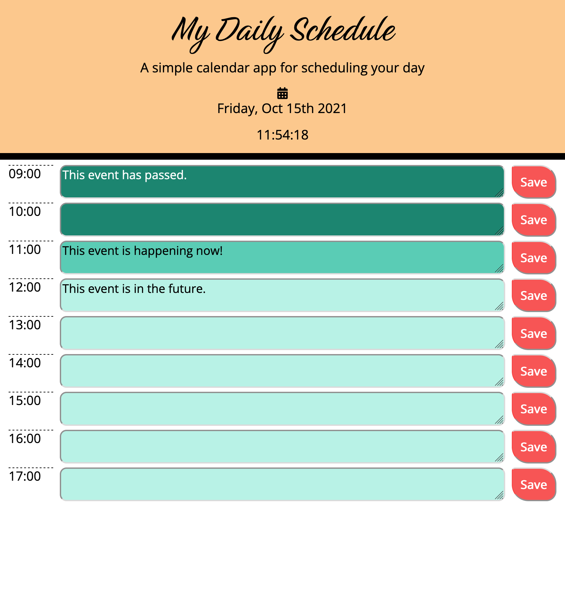

# Day Planner

To help manage time effectively, this responsive planner application displays the current day's events, indicating whether they have already occurred, are currently happening, or are scheduled for later that day. Each newly entered event, when saved, will display in the appropriate time block and remain in local storage.

## Deployed Application

[GitHub Pages link](https://kayleriegerpatton.github.io/work-day-planner/)

## User Story

GIVEN the user is using a daily planner to schedule their day  
WHEN the planner is opened in the browser  
THEN the current date and time are displayed above time blocks spanning the work day

WHEN the user views the time blocks  
THEN each time block is color-coded to indicate whether the event has occurred, is happening now, or is in the future

WHEN the user clicks into a time block  
THEN they are able to type their event details

WHEN the user clicks the time block's corresponding "Save" button  
THEN that event's text is saved in local storage

WHEN the user refreshes the browser page  
THEN the saved events remain in the time blocks

## Built With

- CSS
- HTML
- JavaScript

## Screenshot

